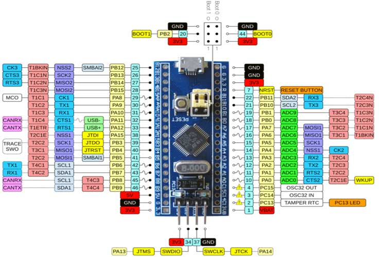

# Firmware Developer Guide
 
In section you will find some tooling and configuration to compile, upload adn debug the source code.

The microcontrolled selected to this firmware is [STM32f103c8tb](https://es.aliexpress.com/item/4001163656356.html?spm=a2g0s.9042311.0.0.216463c00eMEFc)


Which offers CAN Bus, ADC->DMA, USB... and multiple GPIO's to manage the inputs and outputs features required to the capabilites needed.

## Folder structure

```textplain 
./firmware/
  |-- ECU/                 Engine Control Unit
  |-- BCM/                 Body Control Module
  |-- Inc/                 Common firmware includes
  |-- Config/              Debugging and deploy configuration...
  |-- Docs/                Documentation, Schematics, Images...
```
> For more information about `Engine Control Unit` and `Body Control Module` please refer to [./ECU](./ECU) and [./BCM](./BCM) 

## Development Tools Installation

The following tools are required to compile and debug the source code

- [openOCD](http://openocd.org/) `Debugger`
- [arm-none-eabi-gcc](https://developer.arm.com/tools-and-software/open-source-software/developer-tools/gnu-toolchain/gnu-rm/downloads) `Compiler`

It can be installed for `MacOS` or `Linux` using the following command

```shell
./Scripts/install-devtools.sh
```

## STM32 Tools Instalation

First you need an account at [https://www.st.com](https://www.st.com/content/st_com/en/user-registration.html) then type the following command:
```shell
./Scripts/install-stm32tools.sh $username $password --accept-agreement 
```
```texplain
-> Creating temp folder /var/folders/hc/5mngjt250vd3dm1321g4_jrh0000gn/T/dwtmp-install-stm32tools
-> Downloading https://my.st.com/resource/en/license/SLA0048_STM32CubeMX.pdf
-> Login to https://my.st.com/cas/login?service=https://my.st.com/content/my_st_com/en.html
-> Downloading https://my.st.com/content/ccc/resource/technical/software/sw_development_suite/group0/9e/ce/6e/18/d2/ff/46/57/stm32cubemx_v6-0-1/files/stm32cubemx_v6-0-1.zip/jcr:content/translations/en.stm32cubemx_v6-0-1.zip
en.stm32cubemx_v6-0 100%[===================>] 229.17M  4.10MB/s    in 61s     

...

Installation success!
```

# Firmware Tools

## Installing tools

- [stm32flash](https://sourceforge.net/p/stm32flash/wiki/Home/) To upload the firmware through `UART` 
- [stlink board upgrade](https://www.st.com/en/development-tools/stsw-link007.html)
- [stm32cubemx](https://my.st.com/content/my_st_com/en/products/development-tools/software-development-tools/stm32-software-development-tools/stm32-configurators-and-code-generators/stm32cubemx.html) Initialization code generator

```shell
./Scripts/install-stm32tools.sh $username $password  --accept-agreement
```

To create your own STLinkV2 using a STM32f103 

- [Making STLINK V2 Clone with Blue Pill](https://gist.github.com/rubeniskov/e32bfb632fcbc2df14469dcc99dafd77)
- [Burning STM32 Using FTDI R232](https://gist.github.com/rubeniskov/d4efae6266b8278a8add6538d460f928)

to check if stlink is connected successfuly

```shell
# MacOS
ioreg -p IOUSB|grep STM32
# STM32 STLink@14100000  <class AppleUSBDevice, id 0x10000322f, registered, matched, active, busy 0 (13 ms), retain 14>
# Linux
lsusb|grep STM32
```


## Throubleshooting

### `OpenOCD` raise a message error through the `VSCode` DEBUG CONSOLE

```textplain
Error: couldn't bind tcl to socket on port 6666: Address already in use
```

> Sometimes the openOCD loss the parent process of vscode when stop the debugging process and it must be killed manually using the following command:

```shell
# Sends kill signal SIGKILL to the process using the port 6666 (usually openOCD) 
kill -9 $(netstat -vanp tcp|grep 6666|awk '{print $9}')
```
### `OpenOCD` raises Error: invalid command name "adapter"

If you are using an old version of openOCD could raise exception like this due to its incompatibility with the stlink configuration file, try to install a version above `0.10.0+dev-01090-g9ee9bdd2`

```textplain
Open On-Chip Debugger 0.10.0
Licensed under GNU GPL v2
For bug reports, read
	http://openocd.org/doc/doxygen/bugs.html
/Users/rubeniskov/Workspace/cb500_caferacer/firmware/BCM/../Config/stlink.cfg:6: Error: invalid command name "adapter"
...
```

